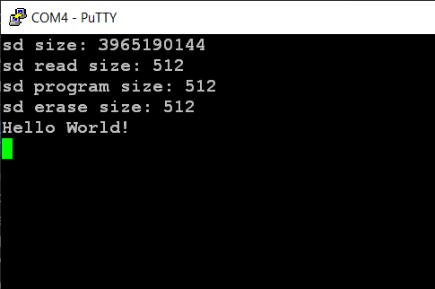

# SD card simple block reading/writing demo
## project name: mbed6_SD
Tested by: **Keil Studio** 1.50 and **Mbed-OS** 6.16.0

This project demonstrates simple block writing/reading on an SD card.
The result can be observed in a terminal window.

### Reference:
[SDBlockDevice example application](https://os.mbed.com/docs/mbed-os/v6.15/apis/sdblockdevice.html) (an example from Mbed-OS User Guide)


## Hardware requirements
* NUCLEO-F446RE development board
* SD card breakout (we used an 1.8" TFT board wich has an SD card socket on the back side)
* USB connection to a PC through the built-in ST-Link v2-1

## Wiring instructions for the NUCLEO-F446RE board

We selected the SPI3 channel for driving the SD card. 

| SD card | color | signal |pin   |
|:-------:|:----: |:-----:|:-------:|
|  DO    | blue   | MISO  | PC11    |
|  SCLK  | yellow | SCLK  | PC10    |
|  DI    | green  | MOSI  | PC12    |
|  CS    | brown  | CS    | PD2     |
|  VCC   | red    | VCC   | 5V/3.3V |
|  GND   | black  | GND   | GND     |


## Software requirements
* Start with an empty mbed 6 project
* Edit the main.cpp source file
* Configure the project by adding an **mbed_app.json** file in which
    * We have to add the **SD** component and the **STORAGE** features_add
    * We have to override the pin connections according to the selected **SPI** channel

Finally the **mbed_app.json** sholuld look like this: 

```
{
    "target_overrides": {
        "*": {
            "target.features_add": ["STORAGE"],
            "target.components_add": ["SD"],            
            "sd.SPI_MOSI" : "PC_12",
            "sd.SPI_MISO" : "PC_11",
            "sd.SPI_CLK"  : "PC_10",
            "sd.SPI_CS"   : "PD_2"
        }
    }
}
```
## mbed6_SD results
Open a terminal window on the PC were the ST-Link v2-1 is connected to.
The default baudrate is 9600 bps. After (re)starting of the program you should se the following output:


